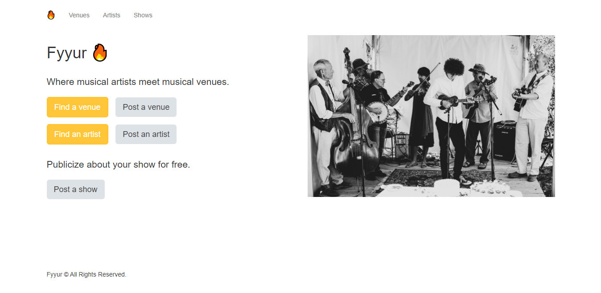

import ProjectParam from '../../components/project-param.js'

### Fyyur App

This is a full-stack web app that helps artists find event centres to perform and helps event centres advertise their venues to future performers. This is the first project I completed as part of my Udacity Full Stack Web Developer Nanodegree.

<ProjectParam techStack={["Python", "Flask", "PostgreSQL"]} gitHubRepo='https://github.com/aishat-liasu/fyyur-project' />

The Desktop View of the Fyyur App

As the frontend aspect was fully implemented in the starter folder for the project, I only worked on the backend aspect of the project.

#### Backend
The primary features of the application are listed below:

1.	Creating new venues, artists or shows
2.	Updating venues or artists’ information
3.	Deleting venues
4.	Searching for venues or artists
5.	Viewing more information about a venue or artist

For each page to work as expected, I created 11 endpoints:

1.	To get all venues
2.	To get all artists
3.	To get all shows
4.	To create a new venue
5.	To create a new artist
6.	To search for venues
7.	To search for artists
8.	To get venue’s information by id
9.	To get an artist’s information by id
10.	To update venue information
11.	To update artist information
