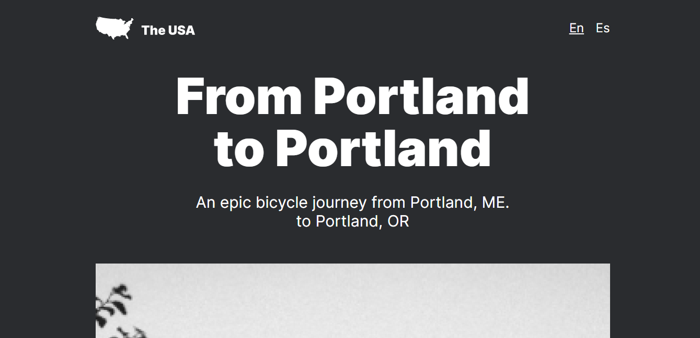

### From Portland to Portland

This is a website I built to cement my understanding of responsive web design using HTML, CSS and BEM Methodology. It was fun to see how much could be done with just HTML and CSS without the use of CSS frameworks or libraries.

My main challenge on the project was figuring out which tag was more appropriate. The usual issues were between div or section or section or article. I finally got the hang of it using the documentation on MDN. 

