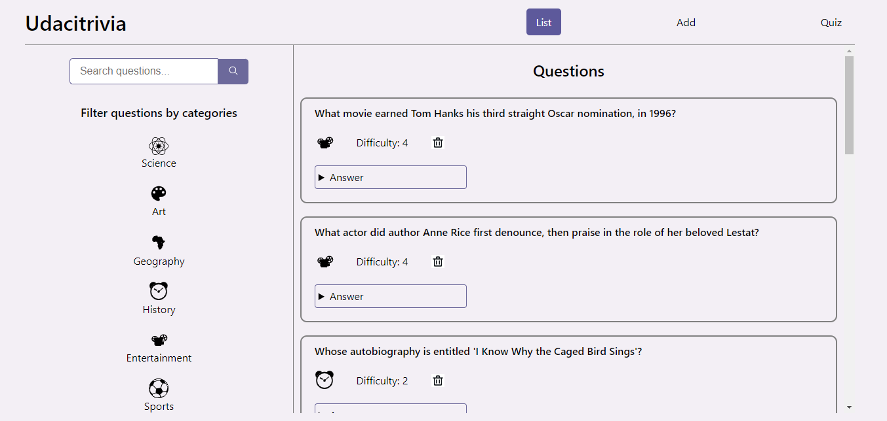
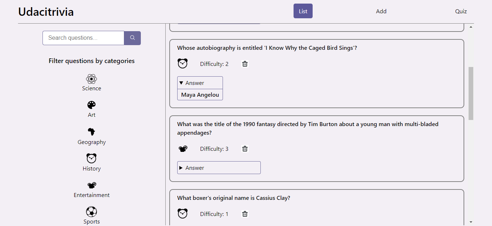
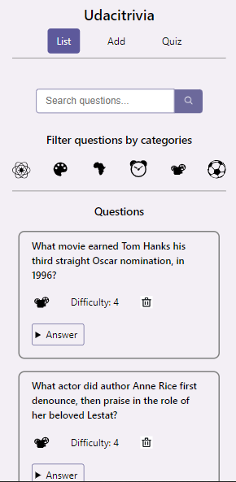
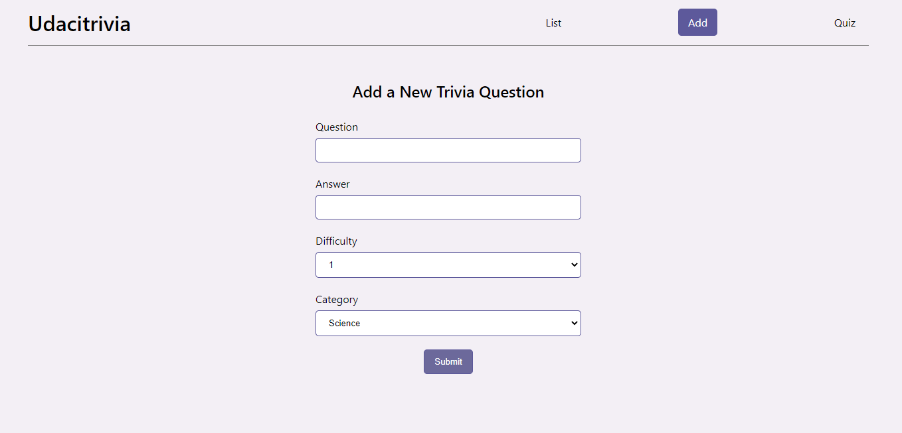
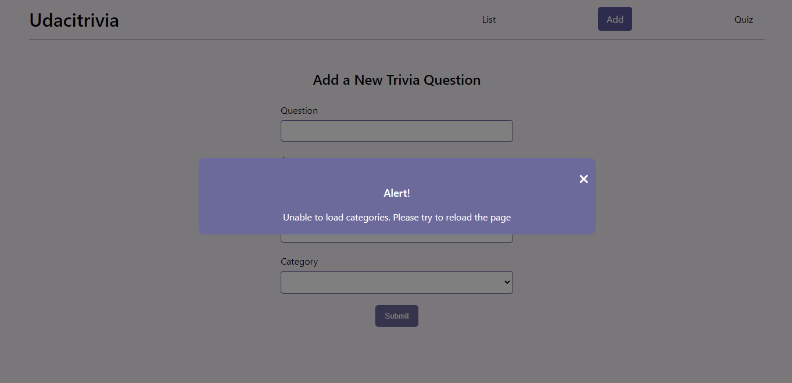
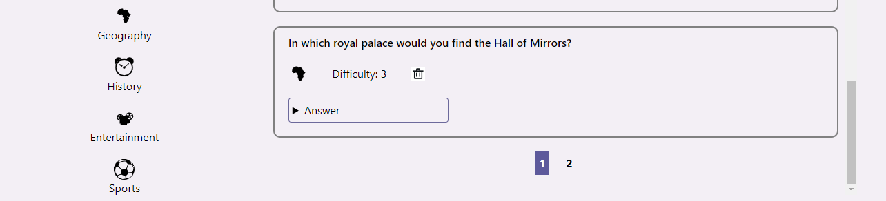
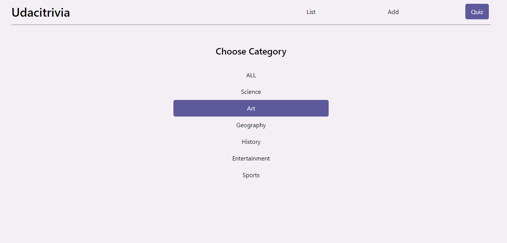
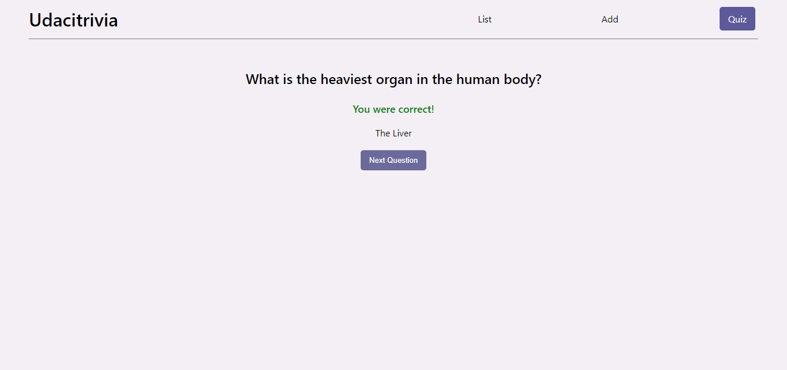

import ProjectParam from '../../components/project-param.js'

### Trivia App

This is an application I built to review my understanding of RESTful API service. This is also the second project I completed as part of my Udacity Full Stack Web Developer Nanodegree. As a full-stack application, it consists of both the frontend and backend. The starter folder for the project included all the assets required for the UI of the frontend view and the logic for rendering each page.

<ProjectParam techStack={["Python", "Flask", "PostgreSQL", "React", "CSS"]} gitHubRepo='https://github.com/aishat-liasu/trivia-app' />

Desktop view of the Trivia App

#### Frontend
The tech stack used for the front end was React (Class-based Components), jQuery and CSS. As most of the logic for rendering the pages had been implemented, I decided to improve upon it by:

1. Changing the tags for most elements to appropriate semantic tags, such as replacing the button elements with `button` tags, the list elements, and its items respectively with `ul` and `li` tags, and using `section`, `article` and `details` tags where appropriate
2. Making the background colour of the navigation link of a page a shade of purple when a user navigates to the page for a better user experience
3. Making the pages responsive for most screen sizes
4. Adding a Popup Component to show up whenever an error occurs

When the answer details is clicked

Mobile view of the Trivia App

Add Page

Error on Add Page

#### Backend  
The tech stack used for the backend was Python, Flask, and PostgreSQL. The main features of the application are listed below:
1.	Displaying questions and answers to a user on the home page in paginated form
2.	Filtering questions by categories 
3.	Searching for questions using the search bar
4.	Creating new questions
5.	Deleting questions
6.	Playing the quiz

A whole of 6 endpoints was created, 

1.	To get all questions with a page query to get a list of paginated questions in groups of 10
2.	To create a new question
3.	To get all categories
4.	To get a filtered list of questions using the inputted text in the search bar as a filter
5.	To get a list of paginated questions per category in groups of 10
6.	To get a random list of questions either based on one category or all categories

The pagination section

Quiz Page

When a user inputs a correct answer on the Quiz Page

When a user inputs a wrong answer on the Quiz Page

