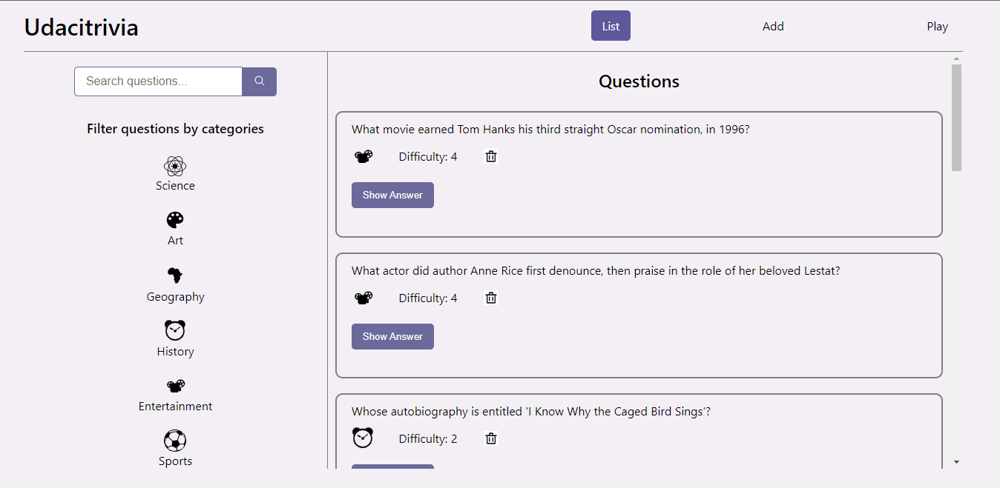

import trivia_destktop_view from '../../images/trivia-desktop-view.png'

### Trivia App

This is an application I built to hone my API creation skills using Flask and Python. This is also the second project I submitted as part of my Udacity Full Stack Web Developer Nanodegree. As a full stack application it consists of both frontend and backend. 

